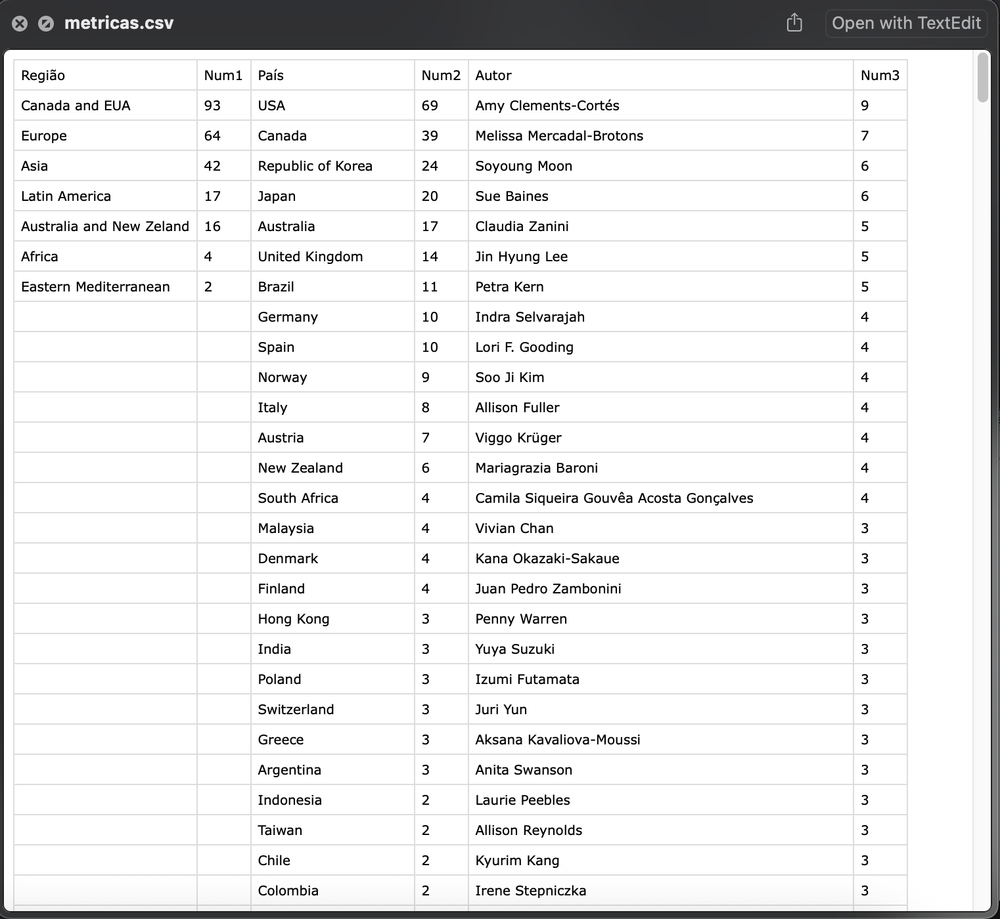

<h1>
  
SheeTeX: An Interactive Python Gadget to Simplify Bibliometric Analysis
</h1>

This project is a Python application with a graphical interface (PyQt5) for loading, manipulating, filtering, and exporting bibliographic data organized in CSV files from a Google Sheets spreadsheet. The tool allows detailed data analysis, including expansion of columns with multiple entries, filtering by region and authors, display in a table with visual grouping, and exporting metrics to CSV.

## Screenshots

### Main interface with loaded data:
<div style="text-align: center;">
  
</div>

### Example of CSV output:
<div style="text-align: center;">
  
</div>

---
## Main Features

### 1. Data Loading and Expansion
- **Load CSV data:** Imports the pre-organized Google Sheets table exported as CSV in real time, also creating a pandas DataFrame.
- **Expansion of the "Ref" column:** If a cell contains multiple references separated by `\n\n`, the script creates a row for each one.
- **Expansion of the "Afiliation" column:** Multiple affiliations separated by a period (`.`) are expanded into separate rows.
- **Expansion of the "Authors" and "Afiliation" columns:** Authors are linked to affiliations, and the country is automatically extracted.

### 2. Filtering and Navigation
- **Region filter:** Dynamic menu with 7 regions.
- **Author filter:** List of authors sorted by frequency or name, allowing multiple selection.

### 3. Display and Interface
- **Dynamic table with visual grouping.**
- **Color coding by region** and hiding duplicates for better readability.
- **Metrics automatically updated** based on filtered data.

### 4. Metrics Export
- **Export metrics to CSV:** Visible metrics can be exported to a CSV file inside the `PYMT` folder on the desktop.
- **Messages via `QMessageBox`** inform about success or failure of the export.
### 4. APA to BibTeX converter

---


## Dependencies

- Python 3.x  
- PyQt5  
- pandas  
- bibtexparser  

---

## Instalation

Follow these steps to run the application:

1. **Clone the repository** (if you haven't yet):
   ```bash
   git clone https://github.com/ivanmoria/sheet_view_extract_bibref.git
   cd sheet_view_extract_bibref
   ```
2. **Install dependencies:** 
   ```bash
   pip install -r requirements.txt
   ```
3. **Run the application:** 
   ```bash
    python sheet.py
    ```
 To facilitate access for users without Python knowledge, you can Clone this repository, run this code in your terminal and install this `.app:`

   ```bash
   pip install pyinstaller
   pyinstaller sheet.spec
```

## Basic Usage

- Load your CSV file exported from Google Sheets.
- Use the filters to select regions and authors.
- View the data in the dynamic table with grouping and region color coding.
- Export the filtered metrics to CSV by clicking the export button.

## Contribution

Contributions are very welcome! If you want to collaborate, please:

- Open an issue to report bugs or suggest improvements.
- Submit a pull request with your changes.
- Send me an e-mail: [ivanmoriabr@gmail.com](mailto:ivanmoriabr@gmail.com)


## Future Implementation: Graphical Visualization with Matplotlib
To further enhance the analysis of bibliographic data and provide intuitive visual representations, the implementation of Matplotlib for generating graphs directly in the application is planned.

Implementation Goals:

- Interactive and static plotting of bibliographic metrics
- Integration with the PyQt5 interface
- Display graphs in popup windows or internal tabs, allowing dynamic analysis and filter selection directly on the graph.

##  Citation
   ```bash
Moriá, I. B. (2025). SheeTeX: An Interactive Python Gadget to Simplify Bibliometric Analysis [Software]. Disponível em https://github.com/ivanmoria/sheet_view_extract_bibref
